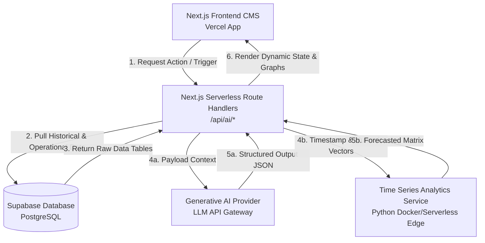
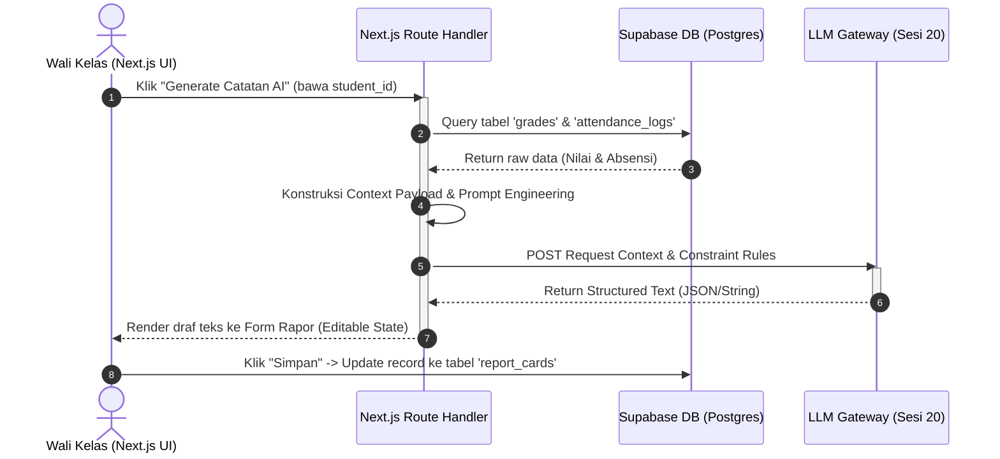
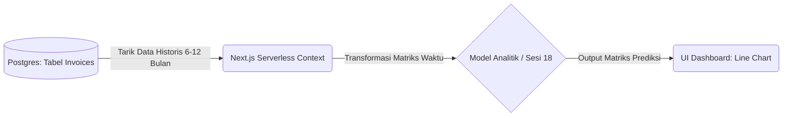

# PRODUCT REQUIREMENT DOCUMENT (PRD)
## **CMS SDS Taman Harapan — Smart AI Features Integration**

---

## 1. Ringkasan Eksekutif & Lanskap Sistem
* **Nama Proyek:** CMS SDS Taman Harapan (AI Enhancement)
* **Target URL:** `https://sds-taman-harapan-cms.vercel.app`
* **Arsitektur Saat Ini:** Serverless BaaS (Next.js Hosted on Vercel + Supabase/PostgreSQL)
* **Tujuan Utama:** Mengintegrasikan kapabilitas Kecerdasan Buatan (Generative AI & Predictive Time Series) secara langsung ke dalam ekosistem serverless tanpa merombak arsitektur inti, guna mengotomatisasi beban kerja administratif akademik dan memberikan proyeksi keuangan sekolah yang akurat.

---

## 2. Arsitektur Sistem & Alur Data (System Architecture)

Sistem ini memotong jalur backend tradisional dengan mengeksploitasi **Next.js Serverless Route Handlers** (Vercel) untuk berinteraksi langsung dengan **Supabase (PostgreSQL)** dan **AI Services Gateway**.

### Diagram Arsitektur Alur Sistem


---

## 3. Spesifikasi Fungsional Fitur (Functional Specifications)

### **Fitur 1: AI Automated Student Progress Report Generator**
* **Deskripsi:** Fitur berbasis Generative AI pada menu *Academic Management* yang mengekstraksi data mentah nilai dan kehadiran siswa untuk diringkas menjadi narasi evaluasi rapor wali kelas secara otomatis.
* **Kriteria Keberhasilan (Acceptance Criteria):**
    * Dapat memproses kompilasi data akademik dalam waktu < 3 detik.
    * Output teks harus berupa JSON terstruktur yang memisahkan *Apresiasi Pencapaian* dan *Rekomendasi Perbaikan*.
    * Menyediakan komponen *Text-Area editor* yang memungkinkan guru melakukan revisi sebelum data dikirim permanen ke database.

#### **Alur Kerja Pengguna & Data (Sequence)**


---

### **Fitur 2: Financial Cash Flow Forecasting System**
* **Deskripsi:** Fitur analitik prediktif pada menu *Financial Management / Dashboard* yang mengadopsi prinsip *Time Series Forecasting* (Sesi 18) untuk memproyeksikan persentase kelancaran pembayaran SPP/iuran pada bulan berikutnya.
* **Kriteria Keberhasilan (Acceptance Criteria):**
    * Menampilkan grafik komparatif (*Line Chart* menggunakan Recharts) antara data riil kas bulan lalu dengan garis proyeksi AI.
    * Mampu membaca tren anomali musiman (misal: penurunan pembayaran saat libur semester).

#### **Alur Kerja Pemrosesan Data Keuangan**


---

## 4. Desain Skema Database (Supabase / PostgreSQL)

Untuk mendukung kedua fitur di atas, relasi data pada PostgreSQL diatur dengan skema berikut:

```mermaid
erDiagram
    STUDENTS {
        uuid id PK
        varchar name
        varchar class_name
    }
    ACADEMIC_GRADES {
        uuid id PK
        uuid student_id FK
        varchar subject
        numeric grade_score
    }
    ATTENDANCE_LOGS {
        uuid id PK
        uuid student_id FK
        integer sick
        integer leave_permission
        integer alpha
    }
    INVOICES {
        uuid id PK
        uuid student_id FK
        numeric amount
        varchar status_bayar
        timestamp due_date
        timestamp payment_date
    }

    STUDENTS {|--o{ ACADEMIC_GRADES : "has"
    STUDENTS ||--o{ ATTENDANCE_LOGS : "tracks"
    STUDENTS ||--o{ INVOICES : "billed_to"
```

---

## 5. Pemetaan Referensi AI Super Class & Model Riset

Dokumentasi ini secara sah mengadopsi hasil riset optimasi dan deployment dari kelas *AI Super Class* berikut:

### **A. Sesi 23: Optimasi & Kompresi Model (8-Bit Quantization & Distillation)**
* **File Riset Terlampir:** `8_Bit_Quantization_(1).ipynb` & `kd (1).ipynb`
* **Penerapan pada CMS:** Digunakan untuk mengompresi model regresi analitik *Time Series* (Sesi 18) agar berukuran sangat kecil (~104 KB dari semula 400 KB) dan hemat memori RAM serverless.
* **Akselerasi Gambar & Deteksi:** Mengacu pada notebook `yolov8_object_detection_openvino.ipynb` untuk optimalisasi pipeline inferensi kecepatan tinggi menggunakan Intel OpenVINO toolkit jika dibutuhkan ekspansi ke pemindaian dokumen fisik sekolah.

### **B. Sesi 24: Cloud Deployment & API Integration**
* **Materi Referensi Cloud:** Integrasi REST API berbasis Docker Container.
* **Penerapan pada CMS:** Menjadi blueprint cadangan apabila model *Time Series* memerlukan isolated environment (FastAPI di dalam Docker Container) yang dapat dipanggil secara lancar oleh API Route Next.js via HTTP fetch.

---

## 6. Non-Functional Requirements & Keamanan Data
* **Security & Key Isolation:** Kunci API LLM maupun *Service Role Key* Supabase wajib disimpan di *Environment Variables* Vercel dan hanya dieksekusi di sisi server (*Server-side rendering / Route Handlers*). Tidak boleh ada kebocoran kunci ke sisi *client/browser*.
* **Optimasi Efisiensi:** Komputasi model analitik yang telah dikuantisasi (Sesi 23) harus dipastikan memiliki response time di bawah batas timeout Vercel Serverless (10 detik untuk *free tier*, atau 60 detik untuk *pro tier*).
